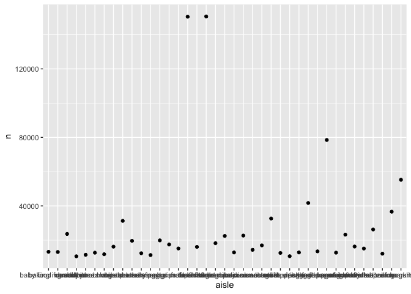
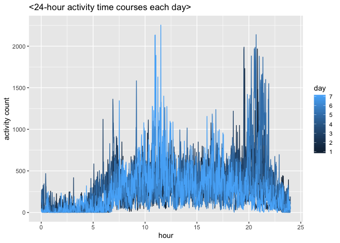
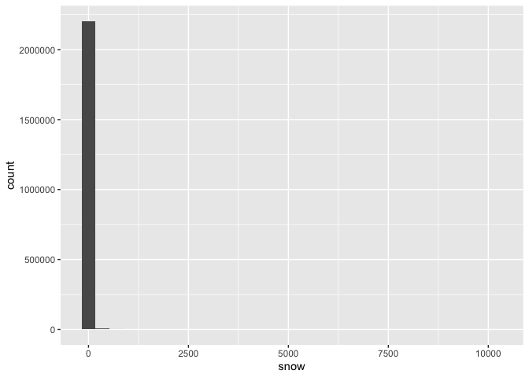

p8105\_HW3\_sp3804
================
Seonyoung Park (sp3804)
10/6/2020

``` r
data("instacart")
glimpse(instacart)
```

    ## Rows: 1,384,617
    ## Columns: 15
    ## $ order_id               <int> 1, 1, 1, 1, 1, 1, 1, 1, 36, 36, 36, 36, 36, 36…
    ## $ product_id             <int> 49302, 11109, 10246, 49683, 43633, 13176, 4720…
    ## $ add_to_cart_order      <int> 1, 2, 3, 4, 5, 6, 7, 8, 1, 2, 3, 4, 5, 6, 7, 8…
    ## $ reordered              <int> 1, 1, 0, 0, 1, 0, 0, 1, 0, 1, 0, 1, 1, 1, 1, 1…
    ## $ user_id                <int> 112108, 112108, 112108, 112108, 112108, 112108…
    ## $ eval_set               <chr> "train", "train", "train", "train", "train", "…
    ## $ order_number           <int> 4, 4, 4, 4, 4, 4, 4, 4, 23, 23, 23, 23, 23, 23…
    ## $ order_dow              <int> 4, 4, 4, 4, 4, 4, 4, 4, 6, 6, 6, 6, 6, 6, 6, 6…
    ## $ order_hour_of_day      <int> 10, 10, 10, 10, 10, 10, 10, 10, 18, 18, 18, 18…
    ## $ days_since_prior_order <int> 9, 9, 9, 9, 9, 9, 9, 9, 30, 30, 30, 30, 30, 30…
    ## $ product_name           <chr> "Bulgarian Yogurt", "Organic 4% Milk Fat Whole…
    ## $ aisle_id               <int> 120, 108, 83, 83, 95, 24, 24, 21, 2, 115, 53, …
    ## $ department_id          <int> 16, 16, 4, 4, 15, 4, 4, 16, 16, 7, 16, 4, 16, …
    ## $ aisle                  <chr> "yogurt", "other creams cheeses", "fresh veget…
    ## $ department             <chr> "dairy eggs", "dairy eggs", "produce", "produc…

# Problem 0

## This “problem” focuses on structure of your submission, especially the use git and GitHub for reproducibility, R Projects to organize your work, R Markdown to write reproducible reports, relative paths to load data from local files, and reasonable naming structures for your files.

# Problem 1

## This dataset contains 1384617 rows and 15 columns.

Observations are the level of items in orders by user. There are user /
order variables – user ID, order ID, order day, and order hour. There
are also item varialbes – name, aisle, department, and some numeric
codes.

## Q1-1 How many aisles, and which are most items from?

``` r
instacart %>%
  count(aisle)%>%
  arrange(desc(n))
```

    ## # A tibble: 134 x 2
    ##    aisle                              n
    ##    <chr>                          <int>
    ##  1 fresh vegetables              150609
    ##  2 fresh fruits                  150473
    ##  3 packaged vegetables fruits     78493
    ##  4 yogurt                         55240
    ##  5 packaged cheese                41699
    ##  6 water seltzer sparkling water  36617
    ##  7 milk                           32644
    ##  8 chips pretzels                 31269
    ##  9 soy lactosefree                26240
    ## 10 bread                          23635
    ## # … with 124 more rows

## Q1-2 Let’s makd a plot

``` r
instacart %>%
  count(aisle)%>%
  filter(n>10000)%>%
  ggplot(aes(x=aisle, y=n))+
  geom_point() # looks unclear 
```

<!-- -->

``` r
## rotate the text in x-axis, reoder aisle in ascending order. 

instacart %>%
  count(aisle)%>%
  filter(n>10000)%>%
  mutate(
    aisle = factor(aisle),
    aisle = fct_reorder(aisle, n)
  ) %>%
  ggplot(aes(x=aisle, y=n))+
  geom_point()+
  theme(axis.text.x = element_text(angle = 90, vjust =0.5, hjust=1))
```

<!-- -->
\#\# Q1-3 Make a table showing the three most popular items in each of
the aisles “baking ingredients”, “dog food care”, and “packaged
vegetables fruits”. Include the number of times each item is ordered in
your table.

``` r
instacart %>%
  filter(aisle %in% c("baking ingredients", "dog food care","packaged vegetables fruits")) %>%
  group_by(aisle) %>%
  count(product_name)%>%
  mutate(rank = min_rank(desc(n))) %>%
  filter(rank <4) %>%
  arrange(aisle, rank) %>%
  knitr::kable()
```

| aisle                      | product\_name                                 |    n | rank |
| :------------------------- | :-------------------------------------------- | ---: | ---: |
| baking ingredients         | Light Brown Sugar                             |  499 |    1 |
| baking ingredients         | Pure Baking Soda                              |  387 |    2 |
| baking ingredients         | Cane Sugar                                    |  336 |    3 |
| dog food care              | Snack Sticks Chicken & Rice Recipe Dog Treats |   30 |    1 |
| dog food care              | Organix Chicken & Brown Rice Recipe           |   28 |    2 |
| dog food care              | Small Dog Biscuits                            |   26 |    3 |
| packaged vegetables fruits | Organic Baby Spinach                          | 9784 |    1 |
| packaged vegetables fruits | Organic Raspberries                           | 5546 |    2 |
| packaged vegetables fruits | Organic Blueberries                           | 4966 |    3 |

\#\#Q1-4 Make a table showing the mean hour of the day at which Pink
Lady Apples and Coffee Ice Cream are ordered on each day of the week;
format this table for human readers (i.e. produce a 2 x 7 table).

``` r
instacart %>%
  filter(product_name %in% c("Pink Lady Apples", "Coffee Ice Cream")) %>%
  group_by(product_name, order_dow) %>%
  summarise(mean_hour = mean(order_hour_of_day)) %>%
  pivot_wider(
    names_from = order_dow,
    values_from = mean_hour
  )
```

    ## `summarise()` regrouping output by 'product_name' (override with `.groups` argument)

    ## # A tibble: 2 x 8
    ## # Groups:   product_name [2]
    ##   product_name       `0`   `1`   `2`   `3`   `4`   `5`   `6`
    ##   <chr>            <dbl> <dbl> <dbl> <dbl> <dbl> <dbl> <dbl>
    ## 1 Coffee Ice Cream  13.8  14.3  15.4  15.3  15.2  12.3  13.8
    ## 2 Pink Lady Apples  13.4  11.4  11.7  14.2  11.6  12.8  11.9

# Problem 2

## Q2-1 Load, tidy, and otherwise wrangle the data. Your final dataset should include all originally observed variables and values; have useful variable names; include a weekday vs weekend variable; and encode data with reasonable variable classes. Describe the resulting dataset (e.g. what variables exist, how many observations, etc).

  - pivot (day- numeric format? character? it affects to the third part
    in the third sub question)

<!-- end list -->

``` r
Accelerometers = 
  read_csv("./accel_data.csv") %>%
  janitor::clean_names() 
```

    ## Parsed with column specification:
    ## cols(
    ##   .default = col_double(),
    ##   day = col_character()
    ## )

    ## See spec(...) for full column specifications.

``` r
Accelerometers = Accelerometers  %>%
  pivot_longer(
    activity_1:activity_1440,
    names_prefix = "activity_",
    names_to = "activity_number",
    values_to = "activity_count")

Accelerometers = Accelerometers %>% 
  mutate(weekend = if_else(day=="Saturday"|day=="Sunday", 1,
                           if_else(day=="Monday"|day=="Tuesday"|day=="Wednesday"|day=="Thursday"|day=="Friday",
                                   0, NA_real_))) %>%
  mutate(weekday = if_else(day=="Monday"|day=="Tuesday"|day=="Wednesday"|day=="Thursday"|day=="Friday", 1,
                           if_else(day=="Saturday"|day=="Sunday", 0, NA_real_)))
  

Accelerometers = Accelerometers %>% 
  mutate(day = if_else(day =="Monday", 1,
                       if_else(day=="Tuesday",2,
                               if_else(day=="Wednesday",3,
                                       if_else(day=="Thursday", 4,
                                               if_else(day=="Friday",5,
                                                       if_else(day=="Saturday",6,
                                                               if_else(day=="Sunday",7, NA_real_))))))))

Accelerometers = Accelerometers %>% 
  mutate(activity_number=as.numeric(activity_number))
Accelerometers = Accelerometers %>% 
  arrange(week,day) 
```

This is the five weeks of accelerometer data collected on a 63 year-old
male with BMI 25, who was admitted to the Advanced Cardiac Care Center
of Columbia University Medical Center and diagnosed with congestive
heart failure (CHF). In this spreadsheet, variables activity.\* are the
activity counts for each minute of a 24-hour day starting at midnight.
So what’s going on in these datasets? First we examine Accelerometers.
This dataset has 50400 observations and 7 variables. All variables are
class `numeric` (double).

\#\#Q2-2 Traditional analyses of accelerometer data focus on the total
activity over the day. Using your tidied dataset, aggregate accross
minutes to create a total activity variable for each day, and create a
table showing these totals. Are any trends apparent? –\> group\_by,
summarise –\> potential issue: day of week column (default; alphabetical
order), we have to change the order

``` r
Accelerometers %>%
  group_by(week, day) %>%
  summarise(total_activity = mean(activity_count)) %>%
  knitr::kable()
```

    ## `summarise()` regrouping output by 'week' (override with `.groups` argument)

| week | day | total\_activity |
| ---: | --: | --------------: |
|    1 |   1 |        54.74171 |
|    1 |   2 |       213.25989 |
|    1 |   3 |       236.19098 |
|    1 |   4 |       247.16920 |
|    1 |   5 |       333.71015 |
|    1 |   6 |       261.28750 |
|    1 |   7 |       438.26736 |
|    2 |   1 |       205.16042 |
|    2 |   2 |       293.92014 |
|    2 |   3 |       306.22361 |
|    2 |   4 |       329.20000 |
|    2 |   5 |       395.02708 |
|    2 |   6 |       421.64931 |
|    2 |   7 |       293.06806 |
|    3 |   1 |       476.32639 |
|    3 |   2 |       264.93542 |
|    3 |   3 |       325.60347 |
|    3 |   4 |       257.79861 |
|    3 |   5 |       324.59722 |
|    3 |   6 |       265.92222 |
|    3 |   7 |       324.34167 |
|    4 |   1 |       284.34028 |
|    4 |   2 |       221.92222 |
|    4 |   3 |       301.70833 |
|    4 |   4 |       236.31319 |
|    4 |   5 |       106.97847 |
|    4 |   6 |         1.00000 |
|    4 |   7 |       180.98403 |
|    5 |   1 |       270.19444 |
|    5 |   2 |       255.43333 |
|    5 |   3 |       309.28194 |
|    5 |   4 |       381.70694 |
|    5 |   5 |       431.15278 |
|    5 |   6 |         1.00000 |
|    5 |   7 |        96.12569 |

``` r
Accelerometers %>%
  group_by(day) %>%
  summarise(total_activity = mean(activity_count)) %>%
  knitr::kable()
```

    ## `summarise()` ungrouping output (override with `.groups` argument)

| day | total\_activity |
| --: | --------------: |
|   1 |        258.1526 |
|   2 |        249.8942 |
|   3 |        295.8017 |
|   4 |        290.4376 |
|   5 |        318.2931 |
|   6 |        190.1718 |
|   7 |        266.5574 |

Just by seeing the total activity for each day of week, it’s hard to see
any apprant trends.

\#\#Q2-3 Accelerometer data allows the inspection activity over the
course of the day. Make a single-panel plot that shows the 24-hour
activity time courses for each day and use color to indicate day of the
week. Describe in words any patterns or conclusions you can make based
on this graph. - scatterplot (x-axis minute time y; activities) + line -
color ; day of week - conclusion; weekday vs. weekend etc

``` r
hourly_activity_day = Accelerometers  %>%
  group_by(day, activity_number) %>%
  summarise(daily_mean = mean(activity_count)) %>%
  mutate(time = activity_number / 60)
```

    ## `summarise()` regrouping output by 'day' (override with `.groups` argument)

``` r
glimpse(hourly_activity_day)
```

    ## Rows: 10,080
    ## Columns: 4
    ## Groups: day [7]
    ## $ day             <dbl> 1, 1, 1, 1, 1, 1, 1, 1, 1, 1, 1, 1, 1, 1, 1, 1, 1, 1,…
    ## $ activity_number <dbl> 1, 2, 3, 4, 5, 6, 7, 8, 9, 10, 11, 12, 13, 14, 15, 16…
    ## $ daily_mean      <dbl> 75.8, 152.6, 89.8, 72.0, 53.4, 135.8, 43.4, 40.8, 137…
    ## $ time            <dbl> 0.01666667, 0.03333333, 0.05000000, 0.06666667, 0.083…

``` r
hourly_activity_day %>%
  ggplot(aes(x=time, y=daily_mean, group=day, color=day)) +geom_line() +ggtitle("<24-hour activity time courses each day>") +xlab("hour") +ylab("activity count")
```

<!-- -->
Based on the graph, we can tell the activity in general reach its peak
around noon, also there are rapid increase at avening (around
20:00-8pm). Unlike traditional total activity analysis, accelerometer
data allows the inspection activity over the course of the day.

\#Problem 3 \#\#Q3-1 Do some data cleaning. Create separate variables
for year, month, and day. Ensure observations for temperature,
precipitation, and snowfall are given in reasonable units. For snowfall,
what are the most commonly observed values? Why?

``` r
data("ny_noaa")
glimpse(ny_noaa)
```

    ## Rows: 2,595,176
    ## Columns: 7
    ## $ id   <chr> "US1NYAB0001", "US1NYAB0001", "US1NYAB0001", "US1NYAB0001", "US1…
    ## $ date <date> 2007-11-01, 2007-11-02, 2007-11-03, 2007-11-04, 2007-11-05, 200…
    ## $ prcp <int> NA, NA, NA, NA, NA, NA, NA, NA, NA, NA, NA, NA, NA, NA, NA, NA, …
    ## $ snow <int> NA, NA, NA, NA, NA, NA, NA, NA, NA, NA, NA, NA, NA, NA, NA, NA, …
    ## $ snwd <int> NA, NA, NA, NA, NA, NA, NA, NA, NA, NA, NA, NA, NA, NA, NA, NA, …
    ## $ tmax <chr> NA, NA, NA, NA, NA, NA, NA, NA, NA, NA, NA, NA, NA, NA, NA, NA, …
    ## $ tmin <chr> NA, NA, NA, NA, NA, NA, NA, NA, NA, NA, NA, NA, NA, NA, NA, NA, …

``` r
ny_noaa = ny_noaa %>%
  janitor::clean_names()

ny_noaa <- ny_noaa %>%
  mutate(year = year(ymd(date)),
        month = month(ymd(date)),
        day = day(ymd(date))) 

ny_noaa = ny_noaa %>%
  mutate(t_max=as.numeric(tmax),
         t_min=as.numeric(tmin))

ny_noaa %>%
  ggplot(aes(x=snow))+geom_histogram()
```

    ## `stat_bin()` using `bins = 30`. Pick better value with `binwidth`.

    ## Warning: Removed 381221 rows containing non-finite values (stat_bin).

<!-- -->
prcp: Precipitation (tenths of mm) snow: Snowfall (mm) snwd: Snow depth
(mm) tmax: Maximum temperature (tenths of degrees C) tmin: Minimum
temperature (tenths of degrees C)

I used histogram of snow of noaa data to see the distribution. For
snowfall, 0 is the most commonly observed. Since snowfall only occurs in
winter, and even in winter it does not occur often.

\#\#Q3-2 Make a two-panel plot showing the average max temperature in
January and in July in each station across years. Is there any
observable / interpretable structure? Any outliers? - data manipulation
- pplot - facet

``` r
ny_noaa %>%
  filter(month==1|month==7) %>%
  group_by(id, year, month) %>%
  summarize(mean_t_max = mean(t_max, na.rm = TRUE)) %>%
  ggplot(aes(x=year,y=mean_t_max, group=id, color=id)) + geom_point() + geom_path()+ facet_grid(~month)+
  labs(title= "<Average max temperature in January and in July in each station across years>", x="year",y="mean max T")+
  theme(legend.position = "none")
```

    ## `summarise()` regrouping output by 'id', 'year' (override with `.groups` argument)

    ## Warning: Removed 5970 rows containing missing values (geom_point).

    ## Warning: Removed 5931 rows containing missing values (geom_path).

<!-- -->
When we see the graph, the maximum temperature seem to fluctuate along
each year and since there are lots of stations in this data, it might
hard to interpret and distinguish the difference between each station
(The graph look a bit messy). However, in general, when we see the
global warming trend through the maximum temperature change along year.

\#\#Q3-3 Make a two-panel plot showing (i) tmax vs tmin for the full
dataset (note that a scatterplot may not be the best option); and (ii)
make a plot showing the distribution of snowfall values greater than 0
and less than 100 separately by year. - filtering - show distribution -
plot

``` r
plot_1 = ny_noaa %>%
  ggplot(aes(x=t_min, y=t_max))+geom_smooth(color="light blue") +
  labs(title= "<T max vs. T min>", x="minimum T (tenths of degrees C)",y="maximum T (tenths of degrees C)")


plot_2 = ny_noaa %>%
  filter(snow >0 & snow <100) %>%
  ggplot(aes(x=year, y=snow))+geom_smooth(color="orange") +
  labs(title= "<Snowfall distribution by year>", x="year",y="snowfall (mm)")
  
plot_1+plot_2
```

    ## `geom_smooth()` using method = 'gam' and formula 'y ~ s(x, bs = "cs")'

    ## Warning: Removed 1136276 rows containing non-finite values (stat_smooth).

    ## `geom_smooth()` using method = 'gam' and formula 'y ~ s(x, bs = "cs")'

<!-- -->
